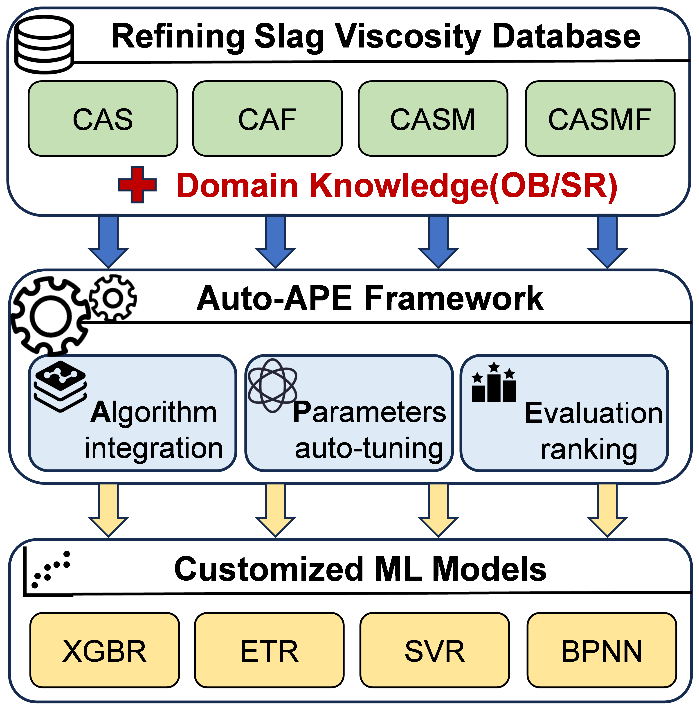

# Refining Slag Viscosity Prediction
Viscosity Prediction of Refining Slag based on Machine learning with domain knowledge

APE framework customized modeling for refining slag system and introduced appropriate domain knowledge features. 

Abstract：High temperatures limit the detection of refining slag properties in metallurgical processes, while model prediction is an effective method to obtain physical and chemical property data. However, the variability and limited data of refining slag systems constrain the predictive performance of individual empirical models. This paper introduces the APE framework, which integrates various ML algorithms, automated hyperparameter tuning, and multidimensional evaluation metrics to predict multi-component refining slag viscosity. Combining optical basicity features, the framework models small datasets of CaO-Al2O3-SiO2, CaO-Al2O3-CaF2, CaO-Al2O3-SiO2-MgO, and CaO-Al2O3-SiO2-MgO-CaF2 systems. The APE framework recommends different algorithms based on the characteristics of each system, and the constructed ML models achieve an average validation error below 15.1%, significantly excellent compared to various empirical models. In addition, the introduction of a deep learning-based symbolic regression method can provide features similar to optical alkalinity, making it a promising tool for uncovering domain knowledge. The method is expected to be applicable to the continuous prediction of physical and chemical properties of refining slags.

Key words： Machine learning, Refining Slag, Viscosity prediction, Domain knowledge

